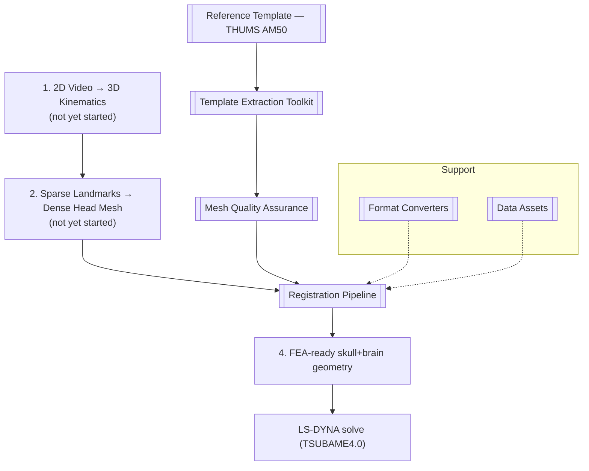
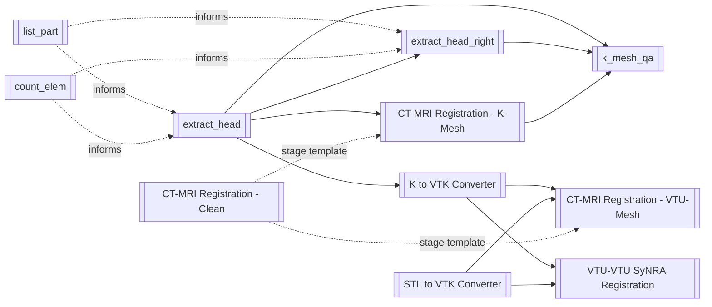

# Architecture — 2D→3D Head Impact Brain Deformation Pipeline

## Overview

This project is a **front-end geometry engine for head-impact brain deformation simulation**. The end goal: take non-invasive 2D sports/boxing video footage, reconstruct a personalized 3D head shape, and warp a reference skull+brain finite-element (FE) template to match it — producing FEA-ready geometry for concussion-risk simulation on **LS-DYNA** (target HPC: TSUBAME4.0).

The core design principle is a **unified transformation**: one displacement/warp field, computed once from the external head shape, applied simultaneously to every anatomical component (skull + brain + meninges) so they deform together and stay anatomically aligned — rather than warping each structure independently.

## Pipeline Stages & Status

| Stage | Status | Related Component |
|---|---|---|
| 2D video → 3D impact kinematics | Not started | [[#Motion & Impact Capture Inputs]] |
| 3D landmarks → dense head mesh | Not started | — |
| Template selection (THUMS AM50 V4.1) | ✅ Confirmed | [[#Reference Template — THUMS AM50]] |
| Head-only extraction | 🔄 In progress | [[#Template Extraction Toolkit]] |
| Mesh QA tooling | ✅ Complete | [[#Mesh Quality Assurance — k_mesh_qa.py]] |
| Registration algorithm (TPS/CPD vs SyN) | 🔄 CPD/TPS now active path (SyNRA abandoned) | [[CPD-TPS Skin-Driven Pipeline]] |
| Warp application to full mesh | 🔄 Run, but fails mesh QA (7,334 inverted elements) | [[CPD-TPS Skin-Driven Pipeline]] |
| Post-warp QA | ⚠ Run — FAIL (interior fold at skull/brain boundary) | [[k_mesh_qa]], [[CPD-TPS Skin-Driven Pipeline]] |
| FEA solve on TSUBAME | ⏳ Blocked on access | — |

---

## Main Components

### Reference Template — THUMS AM50

The whole-body **THUMS AM50 V4.1 Pedestrian** LS-DYNA model is the anatomical starting point — a published, validated reference with skull, brain, meninges/CSF, skin, eyes, and facial musculature all pre-meshed and aligned.

- 772,156 nodes / 1,527,480 solid elements / 443,144 shell elements / 501 parts total
- Fixed-width **I8** element card format (non-standard, no delimiters) — every parser in [[#Template Extraction Toolkit]] has to handle this
- Head-region PIDs are organized by bone/tissue name (not "skull"): cranial vault (`88000001`–`88000099` R/L), brain (`88000100`–`88000125`), meninges+CSF (`88000106`–`88000142`, `88000242`–`88000255`), skin, eyes, face muscles/jaw

Outputs of extracting this template live in the root-level `.k` files:
- `Head_V6.k` — full head extraction (skull+brain+meninges+skin+connectors)
- `Head_V6_head_only.k` — head-only, no full-body parts
- `Head_V6_right_hemi.k` — right-hemisphere-only subset (for the 128K-node LS-DYNA Student cap)
- `Head_V6_head_skin.k` — skin surface only
- `Head_V6_impact_baseline.k` — baseline model prepared for impact simulation

These feed directly into [[#Mesh Quality Assurance — k_mesh_qa.py]] for validation and into [[#Registration Pipeline (SimpleITK)]] / [[#VTU↔VTU SyNRA Registration (ANTsPy)]] as the "moving" mesh to be warped.

### Template Extraction Toolkit

Location: `Code/*.py`. Five scripts, all sharing a hand-rolled `.k`-file parser (`parse_full_k` / `parse_k_file`) that follows `*INCLUDE` chains recursively and decodes the THUMS fixed-width I8 element format.

- **[[list_part]]** — dumps every `*PART` (PID + name), following includes; supports keyword filtering (e.g. `skull`, `brain`, `dura`). Used to build `all_parts.txt`, the master PID reference used to hand-curate the PID sets below.
- **[[count_elem]]** — counts elements per PID, to identify which parts to drop to stay under the LS-DYNA Student **128K node/element cap**.
- **[[extract_head]]** — the main extractor. Filters the full-body THUMS model down to head-only PIDs (skull cranial vault, brain, meninges/CSF, optionally skin), pulls in every referenced `*MAT`/`*SECTION`/`*EOS`/`*HOURGLASS` card, and writes a self-contained `.k` file. Produces `Head_V6.k` / `Head_V6_head_only.k` / `Head_V6_head_skin.k`.
- **[[extract_head_right]]** — a specialized variant that keeps only right-hemisphere skull + brain + CSF (plus shared midline structures like the falx, which can't be dropped without creating an open contact boundary), and patches 4 known degenerate CSF elements. Produces `Head_V6_right_hemi.k`.

All extractor output is designed to be immediately checked by [[#Mesh Quality Assurance — k_mesh_qa.py]] before being handed to a registration notebook.

### Mesh Quality Assurance — k_mesh_qa.py

Full note: [[k_mesh_qa]]

`Code/k_mesh_qa.py` is the pre-solve gate that runs on every `.k` file coming out of [[#Template Extraction Toolkit]] or out of a warp step in [[#Registration Pipeline (SimpleITK)]].

Checks performed:
1. Negative/zero Jacobian (inverted tet/hex elements) — guaranteed LS-DYNA solver crash
2. Extreme aspect ratio — causes solver timestep collapse
3. Duplicate/coincident nodes (a common artifact of surface-driven warps)
4. Zero-area shell elements
5. Per-PID majority-sign winding check (avoids false positives from parts that intentionally use different node-winding conventions)

Usage pattern: `k_mesh_qa.py baseline.k` for a standalone check, or `--compare baseline.k` to diff a warped mesh against its pre-warp baseline — this is the tool that will validate output from [[#Registration Pipeline (SimpleITK)]] and [[#VTU↔VTU SyNRA Registration (ANTsPy)]] once the warp-application steps are run on the full head mesh.

### Registration Pipeline (SimpleITK)

Location: `Code/CT_MRI_Registration_*.ipynb`. A shared 5-stage pipeline (Preprocess → Rigid → Affine → Deformable/Demons → Validation) implemented **without ANTs**, reused across three input/output flavors:

- **[[CT-MRI Registration - Clean]]** (`CT_MRI_Registration_Clean.ipynb` / `_Clean_1.ipynb`) — baseline version, registers volumetric images (`.nii.gz`) directly. Optional SynthSeg skull-stripping. This is the reference implementation the other two notebooks specialize.
- **[[CT-MRI Registration - K-Mesh]]** (`CT_MRI_Registration_K_Mesh.ipynb`) — same pipeline, but the "moving" data is read directly from a `.k` LS-DYNA mesh (parses `*NODE`/`*ELEMENT_*`, voxelizes for registration), and the final composite transform (rigid→affine→deformable) is applied straight to the original node coordinates, writing a new `.k` file. This is the notebook meant to consume output from [[#Template Extraction Toolkit]].
- **[[CT-MRI Registration - VTU-Mesh]]** (`CT_MRI_Registration_VTU_Mesh.ipynb`) — same pipeline again, but for `.vtu` mesh input/output (via PyVista), preserving all point/cell/field data and adding a `displacement_mm` field.

Key rule encoded across these notebooks (from the project handoff): voxelization is only ever used to *compute* the transform; the deformed output always comes from applying the displacement field to the original mesh node coordinates, never from resampling a voxel grid — this avoids staircasing artifacts on thin skull shell elements.

Depends on `.k`/`.vtu` files produced by [[#Template Extraction Toolkit]] or [[#Format Converters]]; output should be validated with [[#Mesh Quality Assurance — k_mesh_qa.py]].

### VTU↔VTU SyNRA Registration (ANTsPy)

- **[[VTU-VTU SyNRA Registration]]** (`VTU_to_VTU_SyNRA_Registration.ipynb` / `_FIXED.ipynb`) — an alternative registration path using **ANTsPy's SyNRA** (Rigid → Affine → diffeomorphic SyN, run as one composite transform), operating mesh-to-mesh with no `.nii.gz` intermediate required by the user (both fixed and moving meshes are voxelized internally, with auto mm/m unit-scale correction and Gaussian blurring for smooth SyN gradients). Point-level warping uses `ants.apply_transforms_to_points()` and preserves all mesh data arrays.
- This is the "SyN" side of the **SyN vs. CPD/TPS** registration-method debate noted in the project handoff: SyN is diffeomorphic (no self-intersections) but tuned for dense voxel-intensity matching, whereas the actual input data (sparse 3D landmarks from video) may be better served by CPD/TPS. This notebook exists to empirically benchmark SyNRA against that alternative using [[#Mesh Quality Assurance — k_mesh_qa.py]]'s inversion-count metric.
- Output of a completed run lives in `Data/outputs/Head_V6_synra_registered.vtu` and `Code/outputs/synra/` (registered `.vtu`, warped `.nii.gz` volumes, validation displacement plots).
- **[[Skin-Only SyNRA Registration]]** (`Skin_Only_SyNRA_Registration.ipynb`) — compute the warp from the skin surface only instead of the whole `Head_V6.vtu`, then apply that single warp to every node in `Head_V6.k`. This is the "unified transformation" principle applied literally, and additionally unlocks `.k`-based [[k_mesh_qa]] validation on the result (the whole-mesh notebook only produces `.vtu`, which `k_mesh_qa` can't parse). Validated by a two-gate check: image-domain Dice/IoU + `k_mesh_qa.py --compare` on the full-model output.

### Format Converters

Location: `Code/STL_to_VTK_Converter.ipynb`, `Code/K_to_VTK_Converter.ipynb`. Utility notebooks that bridge formats between pipeline stages rather than doing registration themselves:

- **[[STL to VTK Converter]]** (`STL_to_VTK_Converter.ipynb`) — lossless STL → VTK conversion, preserving vertex coordinates and triangle faces. Used on `Data/ImageToStl.com_head_voxels.stl` (a segmented head-skin surface, presumably exported from a voxel segmentation tool).
- **[[K to VTK Converter]]** (`K_to_VTK_Converter.ipynb`) — full-fidelity LS-DYNA `.k` → VTK converter. Parses nodes, all element types (hex/tet/penta/shell/beam/truss), parts, materials, sections, and node sets, then assembles a `pyvista.UnstructuredGrid` with part/material/section IDs as cell data. This is what produces the `.vtu` files in `Data/outputs/vtk_export/` consumed by [[#Registration Pipeline (SimpleITK)]]'s VTU variant and by [[#VTU↔VTU SyNRA Registration (ANTsPy)]].

### Data Assets

- **`Data/`** — raw inputs: `head-Model-label.nii.gz` and `Segmentation_transform-skull_solid_surface-label.nii.gz` (segmentation label volumes), `ImageToStl.com_head_voxels.stl` (head-skin surface mesh from voxel segmentation).
- **`Data/outputs/`** — registration/conversion products: `vtk_export/` ([[#Format Converters]] output — `.vtu` + JSON metadata + part distribution plots), `case01/` (full SimpleITK registration run: preprocessed/resampled/rigid/affine/deformable `.nii.gz` volumes + stage-by-stage validation PNGs from [[#Registration Pipeline (SimpleITK)]]), and the SyNRA registration result (`Head_V6_synra_registered.vtu`, `ImageToStl.com_head_voxels_transform_2.vtu`).
- **`Code/outputs/`** — mirrors the above at the code-run level: `case01/diagnostic_separate.png`, `synra/` (SyNRA `.nii.gz` volumes, `Head_V6_synra_registered.vtu`, validation PNGs) from [[#VTU↔VTU SyNRA Registration (ANTsPy)]].
- **`all_parts.txt`** — master PID/name listing generated by `list_part.py`, the reference used to hand-curate every PID set in [[#Template Extraction Toolkit]].

### Motion & Impact Capture Inputs

- **`Video_impact.mp4`**, **`annotated_motion_collision.mp4`** — raw and annotated footage of a head-impact event. These correspond to Pipeline Stage 1 ("2D video → 3D kinematics") in the [[#Pipeline Stages & Status]] table, which per the project handoff has no code yet — no script in `Code/` currently ingests these videos. They exist as source material for the future kinematics-extraction stage that will ultimately drive the "moving" head shape fed into [[#Registration Pipeline (SimpleITK)]].
- **`Head_V6_impact_baseline.k`** — a baseline LS-DYNA head model prepared for impact simulation, output of [[#Template Extraction Toolkit]], intended as the target FEA input once registration/warping is complete.

---

## All Service Notes

Every executable component has its own note (Purpose, Inputs, Outputs, Dependencies, Used by) in the `Services/` folder:

**Template Extraction Toolkit** — [[list_part]] · [[count_elem]] · [[extract_head]] · [[extract_head_right]]
**Mesh QA** — [[k_mesh_qa]]
**Registration (SimpleITK)** — [[CT-MRI Registration - Clean]] · [[CT-MRI Registration - K-Mesh]] · [[CT-MRI Registration - VTU-Mesh]]
**Registration (ANTsPy, superseded)** — [[VTU-VTU SyNRA Registration]] · [[Skin-Only SyNRA Registration]]
**Registration (CPD/TPS, active)** — [[CPD-TPS Skin-Driven Pipeline]]
**Format Converters** — [[STL to VTK Converter]] · [[K to VTK Converter]]

### Dependency graph

## Component Relationship Summary

- [[#Reference Template — THUMS AM50]] → parsed/filtered by [[#Template Extraction Toolkit]] → validated by [[#Mesh Quality Assurance — k_mesh_qa.py]] → registered against subject-specific geometry via [[#Registration Pipeline (SimpleITK)]] or [[#VTU↔VTU SyNRA Registration (ANTsPy)]] → re-validated by [[#Mesh Quality Assurance — k_mesh_qa.py]] → FEA-ready output.
- [[#Format Converters]] sit alongside this chain, converting between `.stl`/`.k`/`.vtk`/`.vtu` wherever a downstream notebook needs a different format than what the previous stage produced.
- [[#Data Assets]] is where every intermediate and final artifact from the above lands.
- [[#Motion & Impact Capture Inputs]] represents the not-yet-built front end of the pipeline that will eventually supply the personalized "moving" head shape.
